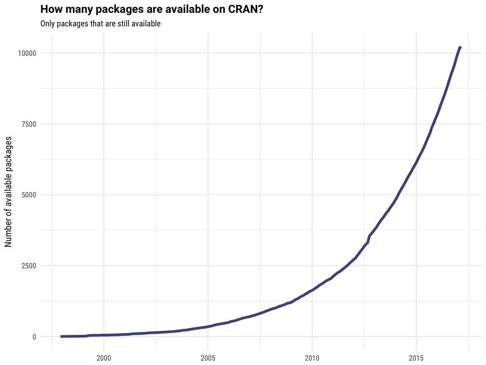

This script takes a while to run because it queries a webpage for every package in the CRAN archives.

## Get the data

Download all currently available packages on CRAN.


```
## # A tibble: 10,211 × 3
##            Name   `Last modified`                Date
##           <chr>             <chr>              <dttm>
## 1            A3 16-Aug-2015 21:05 2015-08-16 21:05:00
## 2       ABC.RAP 20-Oct-2016 08:52 2016-10-20 08:52:00
## 3   ABCanalysis 23-Aug-2016 12:57 2016-08-23 12:57:00
## 4      ABCoptim 17-Nov-2016 09:04 2016-11-17 09:04:00
## 5         ABCp2 04-Feb-2016 10:27 2016-02-04 10:27:00
## 6  ABHgenotypeR 04-Feb-2016 10:27 2016-02-04 10:27:00
## 7           ACA 10-Mar-2016 16:55 2016-03-10 16:55:00
## 8        ACCLMA 29-Oct-2012 12:13 2012-10-29 12:13:00
## 9           ACD 31-Oct-2013 19:59 2013-10-31 19:59:00
## 10         ACDm 16-Jul-2016 10:19 2016-07-16 10:19:00
## # ... with 10,201 more rows
```

Download the archived packages on CRAN, getting their first available dates and how many versions.


```
## # A tibble: 8,894 × 4
##            Name   `Last modified`                Date ArchivedVersions
##           <chr>             <chr>              <dttm>            <dbl>
## 1            A3 16-Aug-2015 21:05 2013-02-07 09:00:00                2
## 2   ABCExtremes 19-Jun-2015 11:26 2013-05-15 08:45:00                1
## 3   ABCanalysis 23-Aug-2016 12:57 2015-04-20 15:40:00                5
## 4      ABCoptim 17-Nov-2016 09:04 2013-11-05 17:00:00                2
## 5         ABCp2 01-Jul-2015 06:12 2013-04-10 15:04:00                2
## 6  ABHgenotypeR 04-Feb-2016 10:27 2016-01-21 07:26:00                1
## 7           ACD 31-Oct-2013 19:59 2012-11-27 06:43:00                2
## 8          ACDm 16-Jul-2016 10:19 2015-07-16 12:24:00                2
## 9          ACEt 18-Nov-2016 21:19 2016-02-14 17:48:00                7
## 10         ACNE 27-Oct-2015 07:09 2011-09-16 17:43:00                4
## # ... with 8,884 more rows
```

## Join the data

Now put it all together.

- Packages that are in `archives` but not `pkgs` are no longer on CRAN.
- Packages that are in `pkgs` but not `archives` only have one CRAN release.
- Packages that are in both dataframes have had more than one CRAN release.


```
## # A tibble: 11,489 × 6
##           Name   `Last modified`                Date ArchivedVersions
##          <chr>             <chr>              <dttm>            <dbl>
## 1           A3 16-Aug-2015 21:05 2013-02-07 09:00:00                2
## 2         aaMI 30-Jul-2010 12:17 2005-06-24 15:55:00                2
## 3       abbyyR 20-Jun-2016 15:32 2015-06-12 04:43:00                7
## 4          abc 05-May-2015 09:34 2010-10-05 08:45:00               10
## 5     abc.data 05-May-2015 09:34 2015-05-05 09:34:00                0
## 6      ABC.RAP 20-Oct-2016 08:52 2016-10-20 08:52:00                0
## 7  ABCanalysis 23-Aug-2016 12:57 2015-04-20 15:40:00                5
## 8     abcdeFBA 15-Sep-2012 13:13 2011-11-05 10:48:00                3
## 9  ABCExtremes 19-Jun-2015 11:26 2013-05-15 08:45:00                1
## 10    ABCoptim 17-Nov-2016 09:04 2013-11-05 17:00:00                2
## # ... with 11,479 more rows, and 2 more variables: Archived <lgl>,
## #   Versions <dbl>
```

Now let's add up how many have been available, by month.




