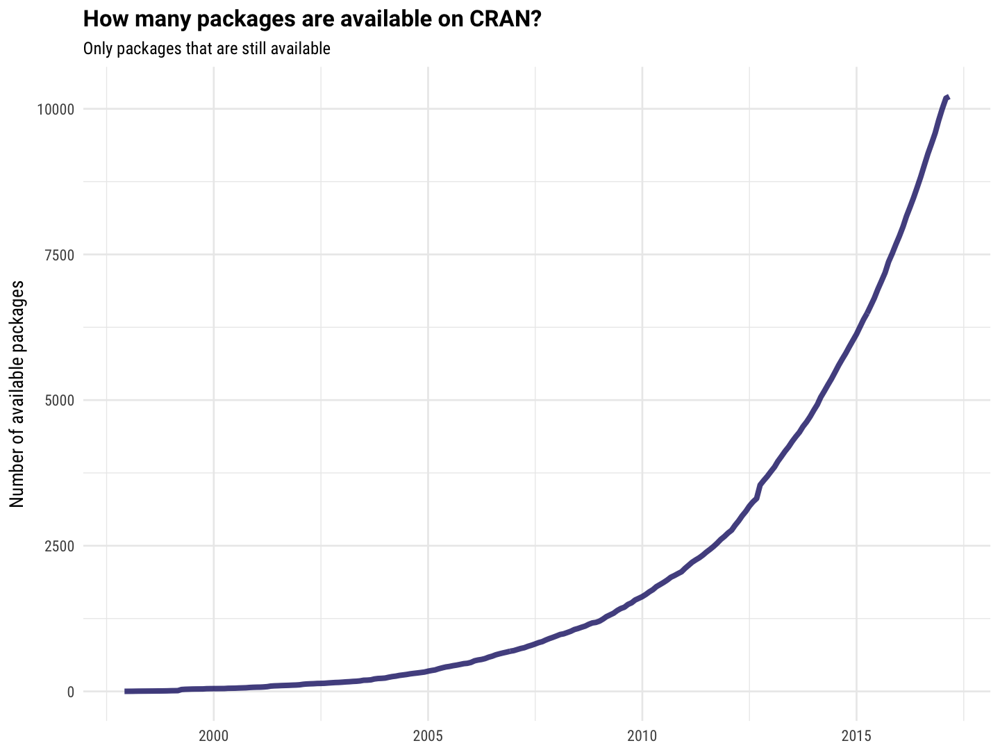

```{r, echo=FALSE, warning=FALSE}
# the image from my cover slide is from https://commons.wikimedia.org/wiki/File:High-quality_lens_flare_rendering.png
```


## Bringing Packages to the Light { .cover .white }


<p class="white">
Julia Silge ([\@juliasilge](https://twitter.com/juliasilge))
</p>
<p class="white">
Stack Overflow
</p>
<p class="white">
[http://juliasilge.com/](http://juliasilge.com/)
</p>


## Packages on CRAN



# GOOD NEWS & BAD NEWS

## What this means for R users {.grid}

- There are many resources out there for many differents kinds of tasks
- It can be difficult to find what you are looking for
- Assessing quality can be a challenge

## What this means for package developers {.grid}

- Most R users are open to trying out new packages
- There are so many packages that it can be difficult to connect with *your* audience

## What is a CRAN Task View?

Let's [check out the Task Views right now](https://cran.r-project.org/web/views/)

## The `ctv` package

```{r}
library(ctv)

available.views(repos = "https://cran.rstudio.com/")
```

## The `ctv` package

```{r, eval=FALSE}
install.views("NaturalLanguageProcessing")

install.views("NaturalLanguageProcessing", coreOnly = TRUE)
```


## Task Views, the UNOFFICIAL VERSIONS

- Sometimes package developers and users put together Task Views on their own
- Check out Ben Marwick's [archaeology CTV](https://github.com/benmarwick/ctv-archaeology) or Thomas Leeper's [open data CTV](https://github.com/ropensci/opendata)

## What this means for Task View maintainers {.grid}

- Making (and keeping!) a Task View useful can be a challenge
- Task Views vary in how helpful and up-to-date they are
- Could more CTVs move to being maintined on GitHub?

## Two possible approaches for CTVs + GitHub

- [Editing a markdown file and using makefiles to get to XML](https://github.com/ropensci/webservices)
- [Editing XML and using a pretty simple script to get to markdown](https://github.com/eddelbuettel/ctv-finance)

## How do people find packages now?

Show results from survey here

# Are you an R User?

## Things to remember

- CRAN Task Views are out there!
- Other tools for search and discovery are also available
- Be engaged with the global R community

# Are you a package developer?

## Things to remember

- Task View maintainers are often open to suggestions about improving the Task Views
- Keep in mind how users learn about packages
- Be engaged with the global R community

